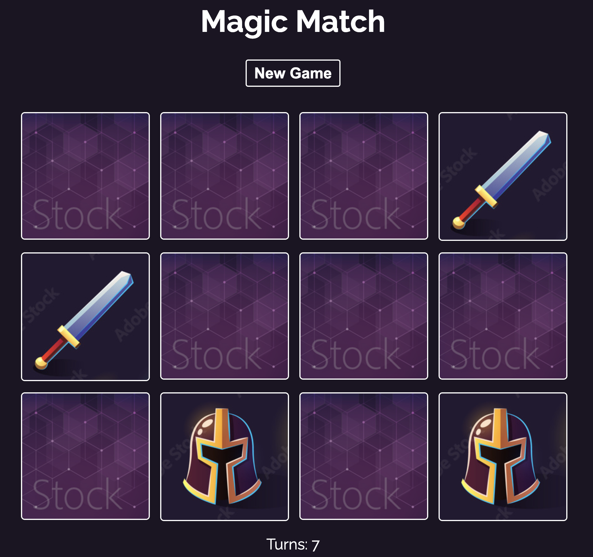

# React_Magic_Memory

Repository created following this [Udemy Course](https://www.udemy.com/course/build-web-apps-with-react-firebase/) to practice the following basic React concepts:

- Components creation & communication.
- Components styling.
- useEffect hook use

## Application

Application is a memory game where player can click on cards. Every couple of cards flipped, app will evaluate if are the same cards. If so, they will stay flipped, if not, they will flip again. There a is a turns counter below the cards grid. If player wants to start again, the button 'New Game' should be clicked



## Run Locally

Clone the project

```bash
  git clone https://github.com/pedrolopezbiedma/React_Magic_Memory.git
```

Install dependencies

```bash
  npm install
```

Start the application

```bash
  npm run start
```

## Authors

- [@pedrolopezbiedma](https://github.com/pedrolopezbiedma)
